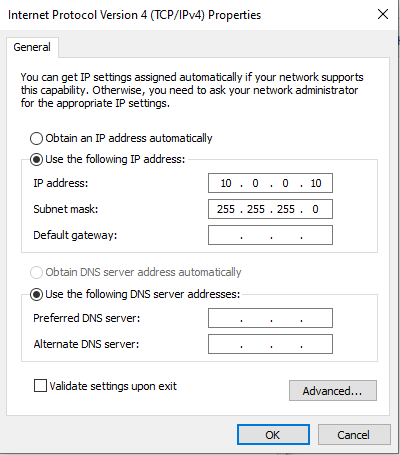
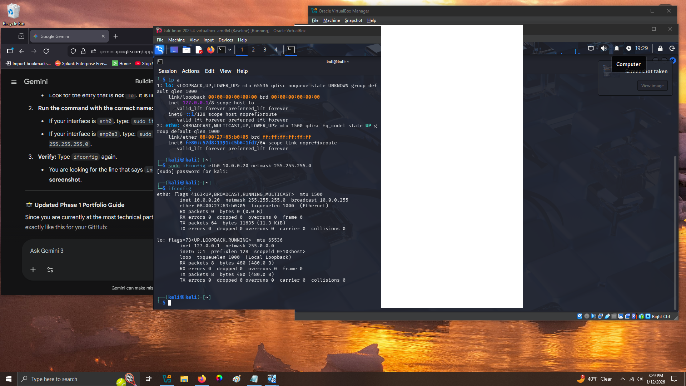
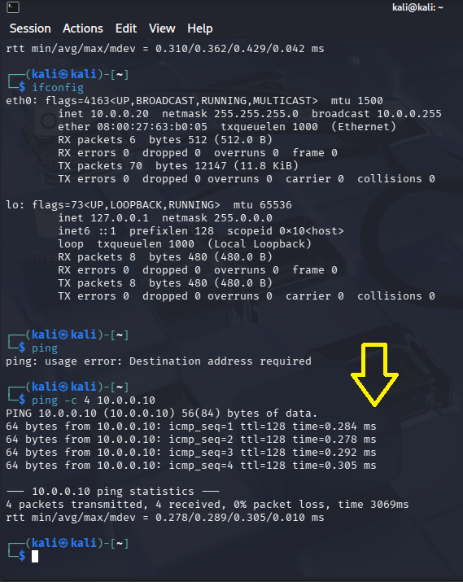
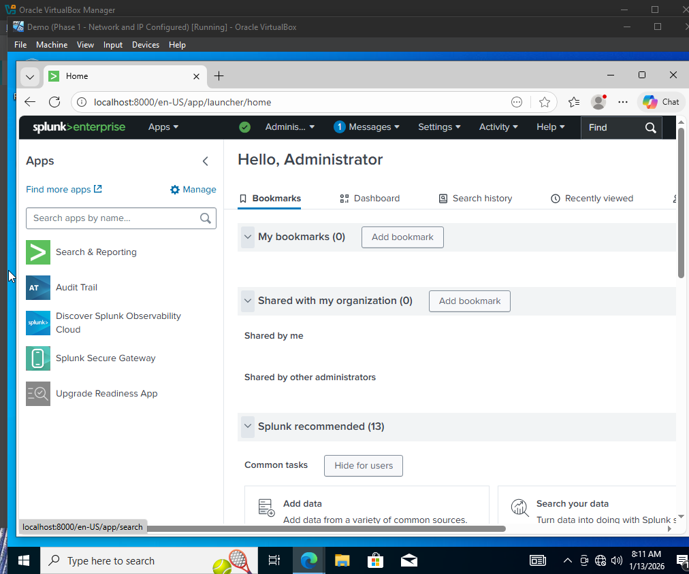
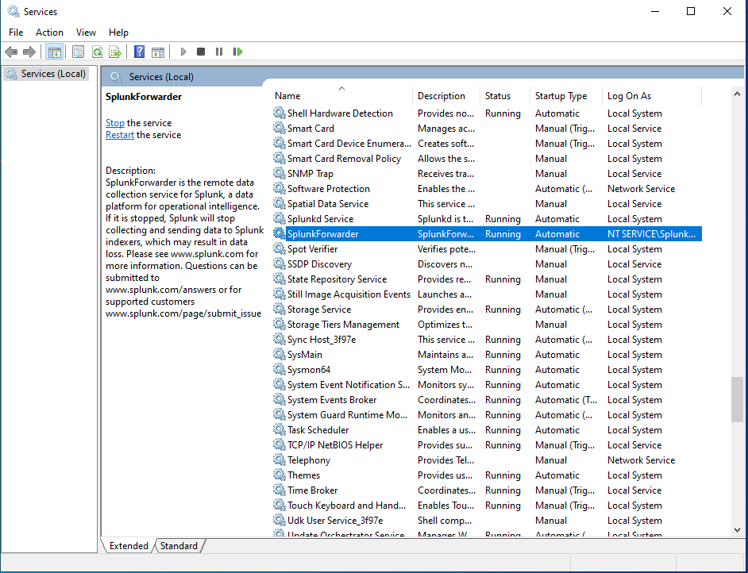
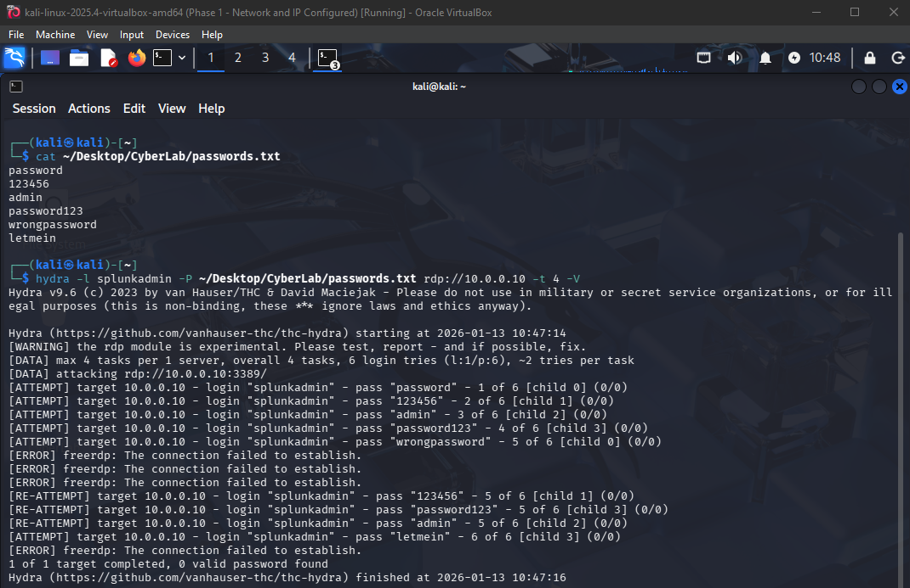
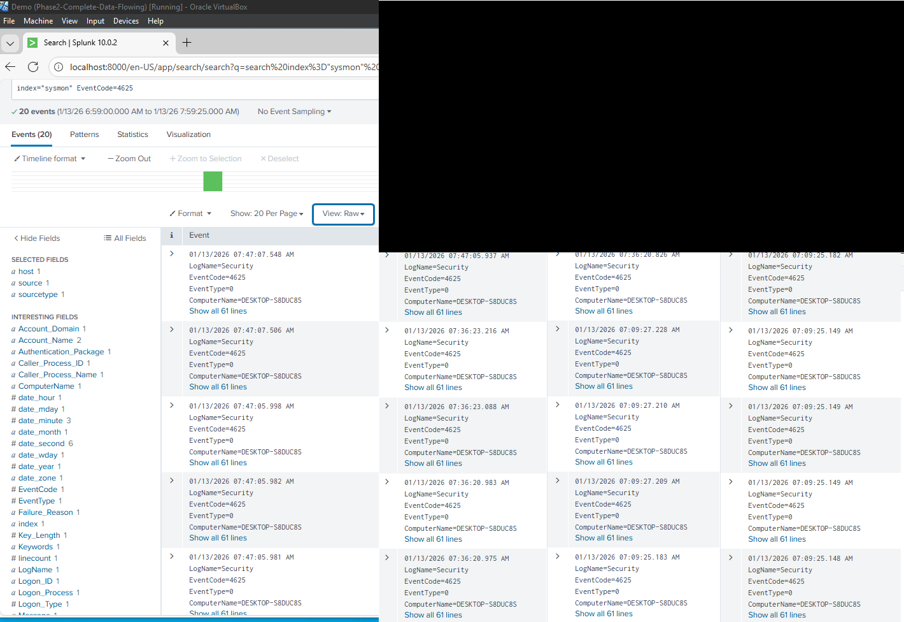

# Splunk-SOC-Lab-BruteForce-Detection
End-to-end SIEM lab: Detecting RDP Brute Force attacks using Splunk, Sysmon, and Kali Linux
# End-to-End SOC SIEM Lab: Brute Force Detection
**Analyst:** Jeffrey D. Parfitt  
**Objective:** Engineer a virtualized SOC environment to simulate, detect, and analyze a Remote Desktop Protocol (RDP) brute-force attack using Splunk and Sysmon.

---

## 🛠️ Phase 1: Sandbox Setup

**01_lab_inventory.png** This project utilizes VirtualBox as the hypervisor to manage a virtualized SOC environment. The infrastructure consists of a Windows 10 Pro victim (endpoint) and a Kali Linux machine for controlled attack simulations.

**02_baseline_snapshots.png** Established Baseline Snapshots for all virtual machines prior to configuration. This provides a fail-safe restoration point, allowing the environment to be reset to a 'clean' state after executing malicious code or intrusive scans.

**03_windows_static_ip.png** Assigned a static IP of 10.0.0.10 to the Windows 10 Pro victim. In a sandboxed environment without DHCP, manual addressing is required to ensure the SIEM remains reachable by other nodes.

**04_kali_static_ip.png** Configured the Kali Linux attacker with a static IP of 10.0.0.20 on the eth0 interface. This manual assignment ensures the attacker remains on the same subnet as the victim within the isolated SOC-Sandbox environment.

**05_connectivity_ping_test.png** Verified end-to-end connectivity between the attacker and victim using a ping test. The successful return of packets confirms the internal network bridge is functional and the laboratory is ready for traffic analysis and log collection.

---

## 🔍 Phase 2: Telemetry & SIEM Engineering

**06_splunk_web_interface.png** Validates the Splunk Web Service availability on the loopback and static IP interface. This ensures the Search Head is operational before start of the data ingestion process.

**07_sysmon_installation.png** Successfully deployed Microsoft Sysmon with the SwiftOnSecurity configuration using an administrative PowerShell prompt. This instrumentation provides deep visibility into the Windows kernel, specifically monitoring for Process Creation (Event ID 1) and Network Connections (Event ID 3), which are vital for identifying adversarial TTPs.

**08_splunk_receiving_port.png** Enabled the Splunk Receiving Port (9997) within the Splunk Web Interface. This configuration acts as a 'listener,' allowing the SIEM to accept incoming telemetry streams from the Universal Forwarder. Establishing this port is the final step in preparing the Search Head to ingest real-time endpoint data.

**09_forwarder_service_status.png** Verified the Splunk Universal Forwarder service is active and running. This agent is responsible for the 'Logistics' of the lab, ensuring that Sysmon telemetry is successfully transported to the Splunk Indexer over Port 9997.

**10_sysmon_index_creation.png** Created a dedicated 'sysmon' index within Splunk. This compartmentalization ensures that high-fidelity endpoint telemetry is stored separately from standard system logs, optimizing search performance and data retention for threat hunting operations.

**11_sysmon_telemetry_verified.png** Verified end-to-end telemetry flow. Sysmon events are now successfully being ingested into the Splunk 'sysmon' index. This validates the configuration of the Universal Forwarder and the successful establishment of the network listener on Port 9997.

---

## ⚔️ Phase 3: Adversarial Simulation & Detection

**12_kali_terminal_ping.png** Confirmed network connectivity between the Kali Linux attacker and the Windows victim. This baseline check ensures the virtual network is active before launching the simulation.

**13_password_list_created.png** Verified the creation of the attack wordlist (passwords.txt) using the cat command. This confirms the dictionary file is correctly formatted and ready for the Hydra brute-force simulation.

**14_hydra_attack_active.png** Successfully executed a dictionary-based brute force attack against the RDP service on the victim machine (10.0.0.10). The Hydra output confirms multiple authentication attempts, which will serve as the primary trigger for our SIEM detection rules.

**15_splunk_brute_force_detected.png** Detection Confirmed: Splunk indexed 20 instances of Event ID 4625 (Logon Failure) in under 10 seconds. This high-frequency pattern is indicative of an automated brute-force attack originating from the Kali Linux terminal (10.0.0.20).
